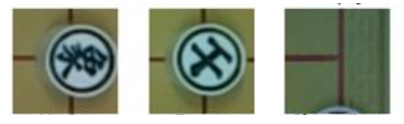

# dev-pieceRecognition
This is the branch that is responsible for creating and training a Tensorflow model. The model will be given a small picture and it will classify what piece of chess is it or declare that there is nothing.

For example, the model will classify images like these:

